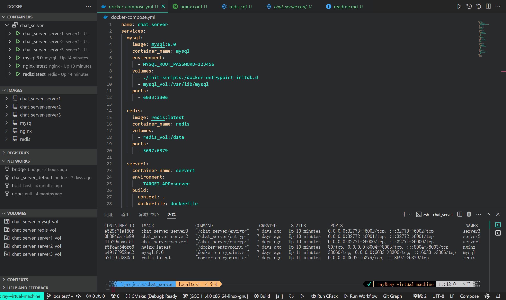
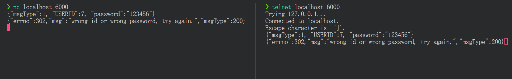

<!--  -->
# 集群IM服务端

客户端源码在：[https://github.com/WlayRay/RayBoxClient](https://github.com/WlayRay/RayBoxClient)

服务器可用于本地部署，也可以部署到云端，使用docker compose一行代码就能部署所有服务。


# 服务

- mysql，端口均是3306,方便数据库客户端直连。
- nginx，端口是8003,反向代理了三个服务节点server1、server2、server3。
- redis，端口是6379,方便redis客户端直连。
- server1、server2、server3随机端口，如6000、6001、6002等，还可以任意添加多个chat_server服务，然后用nginx做负载均衡，这里仅配置了三台。

# 技术特点

- 采用 TCP 长连接实现数据通信，消息传递直接通过目标用户的 TCP 长链接发到客户端。
- 对于不在同一台服务器上的两个用户之间的通信，使用redis的发布订阅功能实现消息的转发。redis 的 connector 是 [`redis-plus-plus`](https://github.com/sewenew/redis-plus-plus)，
- 支持离线消息，离线消息存储在MySQL中，并实现了MySQL连接池 [mysqlconnectionpool.h](src/include/database/mysql/mysqlconnectionpool.h) 和redis的连接池 [redisconnectionpool.h](src/include/redis/redisconnectionpool.h)。
- 使用 [muduo](https://github.com/chenshuo/muduo.git) 网络库中的 TCPServer 构建服务端，实现网络通信。
- 使用 [json](https://github.com/nlohmann/json) 解析数据，自定义应用层协议字段。
- 使用 [dockerfile](dockerfile) 快速构建镜像，所有服务通过 [docker compose](docker-compose.yml) 直接启动，方便管理和维护。
- 使用nginx实现传输层反向代理、负载均衡，实现服务端水平扩展（集群）
- 实现了一个线程安全的异步日志工具类 [logger.h](src/include/log/logger.h)，将 INFO 和 ERROR 两类日志输出到文件和终端。

# 如何使用

有两种部署方式，一种是仅编译chat_serverserver服务，然后其它服务使用本地安装或者docker容器，另一种办法则是全部用docker部署，只需要使用docker compose一行代码就能启动所有容器。

第一种办法，可以参考 [dockerfile](Dockerfile) 文件给出的编译命令，以下简单给出命令和说明。

```shell
# 下载本仓库,必须带上--recursive，这样会自动克隆muduo，hiredis，redis-plus-plus这几个子模块
git clone --recursive https://github.com/WlayRay/RayBoxServer.git


sudo apt update
# 安装mysql的connector
sudo apt install libmysqlcppconn-dev

# 编译、安装muduo网络库
mkdir -p /path to chat_server/dependencies/muduo/build
cd /path to chat_server/dependencies/muduo/build
cmake -DMUDUO_BUILD_EXAMPLES=OFF ..
make -j4
sudo make install

# 编译、安装hiredis库
mkdir -p /path to chat_server/dependencies/hiredis/build
cd /path to chat_server/dependencies/hiredis/build
cmake ..
make -j4
sudo make install

# 编译、安装redis-plus-plus库
mkdir -p /path to chat_server/dependencies/redis-plus-plus/build
cd /path to chat_server/dependencies/redis-plus-plus/build
cmake -DREDIS_PLUS_PLUS_CXX_STANDARD=11 -DREDIS_PLUS_PLUS_BUILD_STATIC=OFF -DREDIS_PLUS_PLUS_BUILD_TEST=OFF ..
make -j4
sudo make install

# 编译 chat_server server
mkdir -p /path to chat_server/build
cd /path to chat_server/build
cmake -DCMAKE_BUILD_TYPE=release -Dchat_server_DISABLE_EXAMPLES=ON -Dchat_server_DISABLE_TESTS=ON ..
make -j4

# 修改mysql和redis的ip地址，（端口号如果不一致也要相应修改），这里是把localhost修改为$mysql和$redis，你需要把$mysql、$redis修改为对应的ip地址
sed -i 's/localhost/$mysql/g' /path to chat_server/bin/mysql.cnf
sed -i 's/localhost/$redis/g' /path to chat_server/bin/redis.cnf

cd /path to chat_server/bin
# 启动server进程，监听6000端口
./server 0.0.0.0 6000
```

此外，还需要导入数据库表，导入脚本见文件 [chat.sql](init-scripts/chat.sql)。

nginx的配置见文件 [nginx.conf](nginx.conf) 和文件 [chat_server.conf](tcp.d/chat_server.conf)。

第一种办法相对麻烦，推荐第二种办法，命令如下，可以快速部署，上云。

```shell
# 下载本仓库,必须带上--recursive，这样会自动克隆muduo，hiredis，redis-plus-plus这几个子模块
git clone --recursive https://gitee.com/ericling666/chat_server

# 启动所有服务，这会下载mysql、redis、nginx等镜像，并且下载ubuntu镜像，用于构建chat_server server镜像，构建脚本见dockerfile文件
docker compose up -d --build
```

服务器启动之后，可以通过`nc <ip> <port>`或`telnet <ip> <port>`快速验证是否启动成功


可以输入以下json格式的字符串，不需要客户端直接与服务器通信：

```json
// 用户登录
{"msgType":1, "USERID":7, "password":"123456"}
// 注册用户
{"msgType":2, "name":"Eric Ling", "password":"whatever"}
// 退出登录
{"msgType":3, "USERID":7}
// 用户聊天
{"msgType":100,"FROMID":7,"TOID":9,"msg":"你好！","sendTime":1703078264002}
// 添加好友
{"msgType":6,"U1":1,"U2":2}
// 查找好友
{"msgType":8,"FROMID":6}
// 群聊消息
{"msgType":9,"FROMID":9,"GROUPID":10,"msg":"你们好！","sendTime":1703078264002}
// 加入群聊
{"msgType":10,"FROMID":6,"GROUPID":7}
// 创建群聊
{"msgType":12,"FROMID":6,"name":"cpp","description":"cpp group."}
// 查询离线消息
{"msgType":14,"FROMID":1}
// 查询账号
{"msgType":15,"keyword":"1"}
```

# 依赖库

其中libmysqlcppconn-dev通过apt直接安装，json库引入头文件，muduo、hiredis、redis-plus-plus都是通过源码构建再引入。

- libmysqlcppconn-dev
- [muduo](https://github.com/chenshuo/muduo.git)
- [hiredis](https://github.com/redis/hiredis.git)
- [redis-plus-plus](https://github.com/sewenew/redis-plus-plus.git)
- [json](https://github.com/nlohmann/json)

# 其他

使用 Jmeter 对项目进行压测：[点击跳转至教程](https://wlayray.github.io/%E4%BD%BF%E7%94%A8jmeter%E5%8E%8B%E6%B5%8BTCP%E9%A1%B9%E7%9B%AE/)
